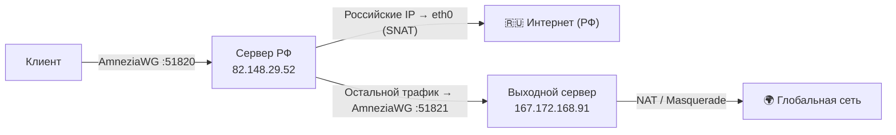

# Архитектура Proxy-цепочки AmneziaWG

## Схема маршрутизации

## Узлы

### 1. Входной узел — Сервер РФ (`82.148.29.52`)

| Параметр | Значение |
|---|---|
| ОС | Debian 11 (Bullseye), ядро `5.10.0-39-amd64` |
| Модуль ядра | `amneziawg.ko` (установлен через официальный PPA) |
| Режим работы | **Kernel-side** |
| Клиентский интерфейс | `awg0` — `10.8.0.0/24` |
| Интерфейс к AM-серверу | `awg1` — `10.9.0.0/24` |

**Логика маршрутизации:**
- При старте скачивает актуальный список IP-подсетей РФ и загружает их в `ipset`.
- Трафик в пределах РФ-подсетей → выходит через `eth0` (SNAT с IP хоста).
- Весь остальной трафик маркируется через `iptables` (fwmark) → уходит через туннель `awg1` на выходной сервер.

### 2. Выходной узел — Сервер AM/NL (`167.172.168.91`)

| Параметр | Значение |
|---|---|
| ОС | Debian 13 (Trixie), ядро `6.12.74+deb13+1-amd64` |
| Модуль ядра | `amneziawg.ko` (скомпилирован через DKMS из исходников) |
| Режим работы | **Kernel-side** |
| Интерфейс от RU-сервера | `awg0` — `10.9.0.0/24` |

**Логика маршрутизации:**
- Принимает туннелированный трафик от RU-сервера.
- Выпускает его в глобальную сеть через `iptables MASQUERADE` по `eth0`.

### 3. Клиент

Подключается к Серверу РФ через AmneziaWG (`AllowedIPs = 0.0.0.0/0`). Браузер и все приложения видят только один туннель.

## Docker-архитектура

Оба узла упакованы в Docker-контейнеры. Это обеспечивает идемпотентный деплой одной командой.

| Контейнер | Образ | Привилегии |
|---|---|---|
| `awg-ru` | `server-ru` (локальная сборка) | `NET_ADMIN`, host-сети |
| `awg-am` | `server-am` (локальная сборка) | `NET_ADMIN`, host-сети |

> **Ключевое изменение по сравнению с начальной архитектурой:** Контейнеры изначально проектировались под userspace-реализацию `amneziawg-go` (не требует модулей ядра). После установки нативного модуля `amneziawg.ko` на оба хоста, контейнеры **автоматически** начали использовать интерфейсы ядра. Флаг `NET_ADMIN` и доступ к хост-сети (`network_mode: host`) для этого достаточны.

## Сетевые подсети

| Сеть | Назначение |
|---|---|
| `10.8.0.0/24` | Клиенты ↔ RU-сервер |
| `10.9.0.0/24` | RU-сервер ↔ AM-сервер |
